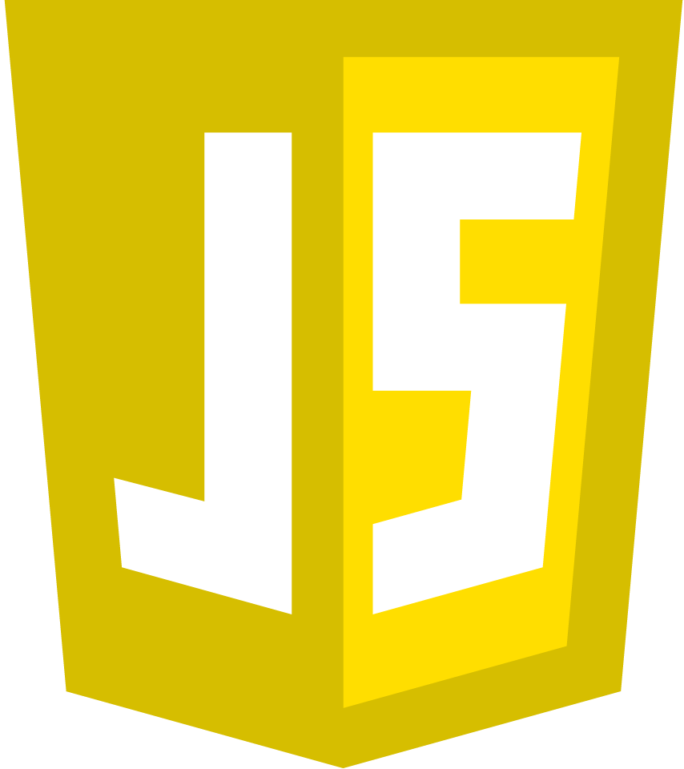
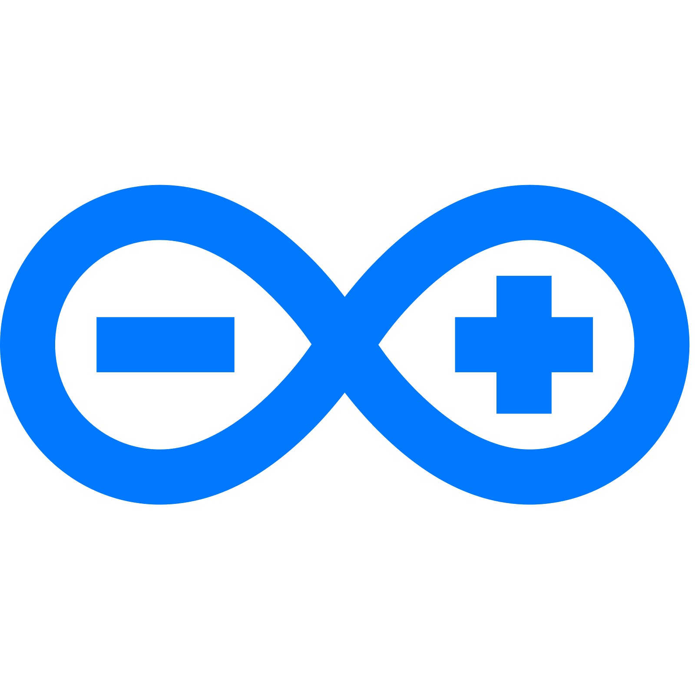

<h1 align="center">

</h1>

<h5 align="center">
  <code>
    <a href="https://www.linkedin.com/in/arda-yıldırım-783798244/" title="LinkedIn Profile"> LinkedIn</a></code>
  <code><a href="https://www.instagram.com/veachisx/" title="Instagram Profile"> Instagram</a></code>
</h5>
 

  Hi, I'm Arda YILDIRIM, & Frontend Developer from Turkey
   
   
  🌍  I'm based in İstanbul
   
  ✉️  You can contact me at ardaogulcanyildirim@gmail.com
   
  🧠  I'm learning HTML, CSS, JavaScript, ReactJS and NodeJS
   
  💻 I love writing code and learn anythings about it
   

<h2 align="center">🔥 Languages 🔥</h2>
 

  <code></code>
  <code></code>
  <code></code>
  <code></code>
  <code></code>
  <code></code>

<h2 align="center">⚡ Stats ⚡</h2>
 

  

    
    
  

           
  

    
  

   
  

